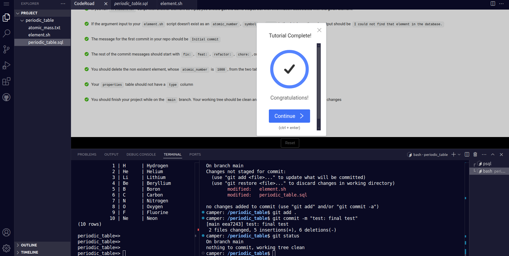

# FreeCodeCamp Relational Database Certification Project

This project is part of the **FreeCodeCamp Relational Database Certification**. It involves modifying a database using PostgreSQL and interacting with it using a Bash script.

## Project Overview

The project consists of a PostgreSQL database named periodic_table in the `periodic_table.sql`, containing information about chemical elements. A Bash script, `element.sh`, queries the database to retrieve and display element details based on user input.

## Technologies Used

PostgreSQL: Database management system

Bash Scripting: To query and fetch data from the database

SQL Queries: Used to interact with PostgreSQL

## Usage

Run the script and pass an atomic number, symbol, or element name as an argument:
```
./element.sh hydrogen
./element.sh H
./element.sh 1
```

## Proof




